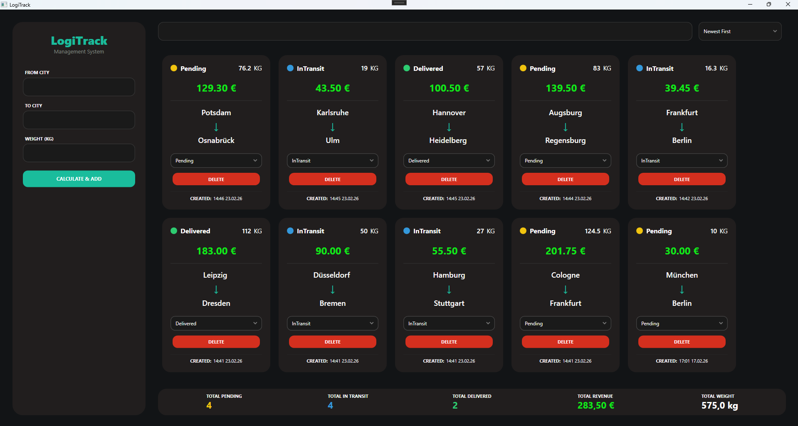

# 📦 LogiTrack Management System

A professional, multi-layered logistics tracking application built with **.NET 8**, **WPF**, and **Entity Framework Core**.

## 🚀 Key Features
* **Shipment Management**: Complete system to add, update, and track shipments.
* **Dynamic Calculation**: Real-time delivery price calculation based on shipment weight (current calculations are performed using a randomized algorithm).
* **Interactive Dashboard**: Visual tracking of total revenue, pending, in-transit, and delivered items.
* **Custom UI**: Premium dark theme with custom-styled scrollbars, buttons, and layout.
* **Search & Sort**: Efficient filtering and sorting systems for large datasets.

## 🏗 Project Architecture
The solution follows **Clean Architecture** principles to ensure maintainability and scalability:
* **LogiTrack.Desktop**: WPF Client with modern UI components and MVVM-ready structure.
* **LogiTrack.Api**: RESTful API service for external integrations.
* **LogiTrack.Application**: Business logic layer, DTOs, and Service interfaces.
* **LogiTrack.Infrastructure**: Data access layer, EF Core DbContext, and Repository implementations.
* **LogiTrack.Domain**: Core domain entities and repository interfaces.

## 🛠 Tech Stack
* **Framework**: .NET 8.0
* **UI**: WPF (Windows Presentation Foundation)
* **Database**: SQLite (Local storage)
* **ORM**: Entity Framework Core
* **Patterns**: Repository Pattern, Dependency Injection

## 📸 Preview


## 🚀 Getting Started

### 1. Clone the repository
```bash
git clone [https://github.com/YOUR_USERNAME/LogiTrack.git](https://github.com/StanislavVidulin/LogiTrack.git)
